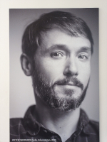

## Postdoctoral researcher 2022 – 2024

Previous postdocs, research positions, and PhD:

- [Ronquist Lab (Bioinformatics) of the Swedish Museum of Natural History](https://ronquistlab.github.io/people.html#viktor): Bayesian modeling of phylogenetics
- [Broman Lab (Programming languages and compilers) at KTH Royal Institute of Technology](https://people.kth.se/~dbro/team.html): front-end compiler development
- [Pensoft Publishers](https://pensoft.net): biodiversity semantic publishing

## Employment Opportunity

I am interested in permanent positions or permanent-track positions that will allow me to pursue data science research for the benefit of biology.  My primary scientific interests are intelligent databases (more recently knowledge-backed conversational agents) and modeling languages.  I have been a leader of two large academic software projects—the [OpenBiodiv](https://openbiodiv.net) semantic database and the [TreePPL](https://treeppl.org) probabilistic programming language—so I am open to applied and managerial positions, not only pure research.  Here, you can read a [research statement](attachments/NRM_5__Long_term_research_agenda.pdf) from me and my [CV](attachments/NRM_1__CV_academic.pdf) as of the end 2023.

## Contacts

|  | [Personal website](https://senderov.net)  [GitHub Account](https://github.com/vsenderov)  [LinkedIn](https://www.linkedin.com/in/viktor-senderov-590b3127/) |
| --------------------------------------------------------------- | ----------------------------------------------------------------------------------------------------------------------------------------------------------------- |

