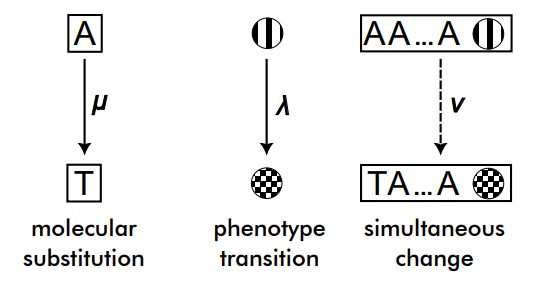
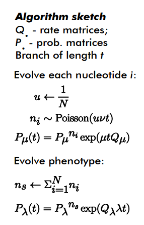
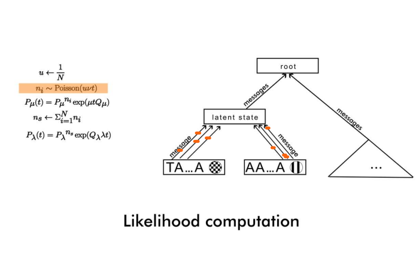
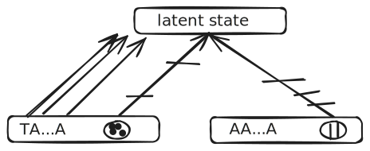

The QT model is a model of simultaneous molecular and phenotypic evolution in which we are given three rates:

  - $\mu$ – rate of molecular evolution, i.e. molecular substitution rate
  - $\lambda$ – rate of phenotypic evolution, and
  - $\nu$ – rate of simultaneous phenotypic and molecular evolution

For the molecular process one may select any known continuous-time substitution model, such as Jukes-Cantor, GTR, and so on.  We refer to [Molecular Evolution: A Statistical Approach](http://abacus.gene.ucl.ac.uk/MESA/) by Ziheng Yang for more details.  For the phenotypic process, the same statement holds, an example of a supported model is the [Mk model](https://lukejharmon.github.io/pcm/chapter7_introdiscrete/).  Such models can be combined in a straightforward fashion by modifying the Q-matrix, by crossing the outcome space.  For example, if we had a molecular site that can be A, C, G, or T, and a phenotype that could be 0, or 1, the possible states are A0, C0, G0, T0, A1, C1, G1, and T1, and one can write an 8x8 Q-matrix incorporating the individual rates for all possible transitions. Apropos, this can be done trivially for two phenotypes as well.

The challenge is if you want to model the evolution of a whole gene _together_ with a phenotype.  All the possible nucleotide states of a gene are exponential with number of nucleotides (which is typically in the thousands), so it is impractical to write out the Q-matrix.  To overcome that our idea is to simplify the model somewhat by simulating (data augmenting) the number of simultaneous jumps of the gene and the phenotype, which we denote _s-jumps_. Roughly speaking, if an s-jump occurs, then both the gene and the phenotype jump in accordance to their own jump matrices, i.e. we do not model a different jump probability between different combinations of genotype and phenotype—no matter what’s the current phenotype and the current genotype, the jump rate is the same—$\nu$.

However, we have two sub-models for $\nu$.

## Algorithm 1

Here, an s-jump means that _exactly one_ nucleotide jumps and the phenotype jumps.

The difficulty here is that you need to simulate for each site the number of s-jumps and then add them up.  We found out that this resulted in very intractable inference.

## Algorithm 2

Here, we take a slightly more probabilistic approach to the interpretation of an s-jump.  Namely, we introduce an additional rate $p$, which is the probability that, given an s-jump, and individual nucleotide will transition.  If $p=1/N$, where $N$ is the length of the gene, in expectation this algorithm becomes the first algorithm.

  1. Sample $n \sim Poisson(\nu t)$.
  2. Then given the number of s-jumps on the edge, sites evolve independently and site i jumps a number $n_i \sim Binomial(n, p)$.
  3. Transition probability matrix for the sequence becomes $P_\lambda(t)=((1-p)I + pJ)^n exp(\lambda t Q_\lambda)$.

This allows us to simulate only one number of s-jumps for each branch, and then integrate out the message likelihood (in Felsenstein’s pruning algorithm) for each site.  (You may want to switch to dark mode from the toggle in the upper right, if you don’t see the sketch below).

We had computational difficulties with this approach as well.

## Related models

[Pelican](https://gitlab.in2p3.fr/phoogle/pelican) is a related model, but it operates on a site-by-site basis.