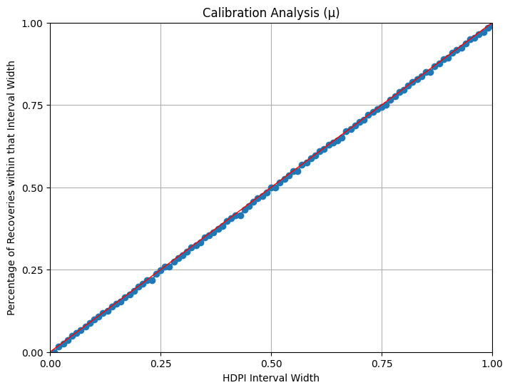

The results of QT analysis are still to be published.  Here, I am summarizing the preliminary findings and giving some future directions.

## Model verification

We used [simulation-based calibration](https://arxiv.org/abs/1804.06788) to verify the correctness of our likelihood implementation vs the generative model:

  - we simulate data with the [simulators](Implementation%20in%20WebPPL.md) (short “genes” 10–100 nucleotides, small trees: < 50 sp)
  - we then infer using [the inference in TreePPL](Implementation%20in%20TreePPL.md)
  - we plot the true known values against their inferred credible intervals and expect to find that the credible intervals are well calibrated

We found what we expected:

|                    |
| ---------------------------------------------------- |
|                     |
|  |

## Biological results

As the bird dataset was not available, we attempted to apply the model on [an echolocation dataset from Pelican](https://gitlab.in2p3.fr/phoogle/pelican/-/tree/main/data?ref_type=heads).  However, all three genes linked to echolocation had > 2,000 nucleotides.  SMC inference resulted in out-of-memory errors, whereas MCMC inference did not converge in reasonable time.  We are currently improving the MCMC backend of TreePPL and it is possible that the new backend can handle the model.

## Archive

Out [Python notebooks](https://drive.google.com/file/d/1Zxr7-7cDTnOysCE4JEdt86Qx9D9gfIdu/view?usp=sharing) containing numerical exploration, as well as [lab notes](https://drive.google.com/file/d/1ZzYo7cbCjNjo3boIQLWbb6b6jDf3NcW-/view?usp=sharing) are available to download here.  However, those are unorganized and contain experimental explorative code.  Therefore, they are also password-protected[^1].

[^1]: `openssl enc -d -aes-256-cbc -pbkdf2 -in experiments.tar.bz2.enc -out experiments-decrypted.tar.bz2 -k PWD -iter 10000`